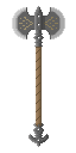
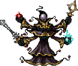
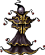
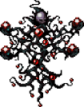
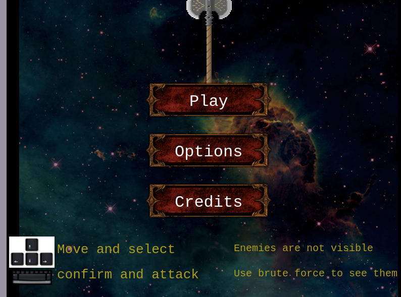
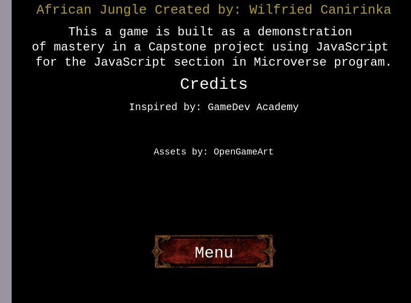
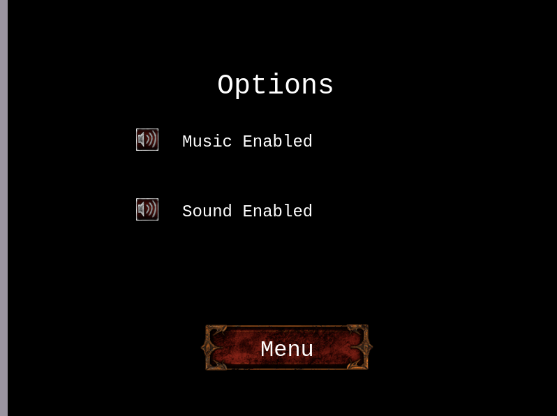
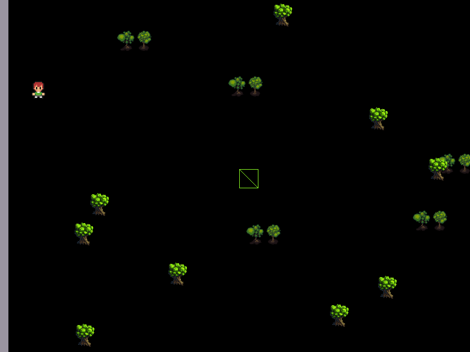
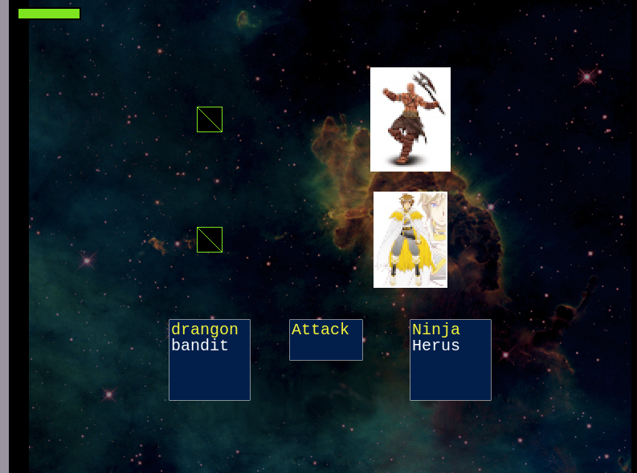

 
[![Contributors][contributors-shield]][contributors-url]
[![Issues][issues-shield]][issues-url]
 

# JavaScript Capstone Project: Build an RPG game

# AFRICAN JUNGLE 

This is Microverse's final project for the Javascript section.

In this project I implemented an RPG game using [Phaser 3](http://phaser.io/tutorials), an open-source framework for Canvas and WebGL powered browser games.

## Table of Contents

  - [About](#about)
  - [The game](#the-game)
    - [How to play](#how-to-play)
    - [Design](#design)
      - [Player characters](#players-characters)
      - [Enemies](#enemies)
      - [Scenes](#scenes)
  - [Technologies used](#technologies-used)
  - [Learning Objectives](#learning-objectives)
    - [Transversal](#transversal)
    - [Soft skills](#soft-skills)
    - [Technical](#technical)
  - [Contact](#contact)
  - [Acknowledgements](#acknowledgements)

## About

This project's objective was to build a platform game similar [GameDev Academy](https://gamedevacademy.org/how-to-create-a-turn-based-rpg-game-in-phaser-3-part-1/).The main objective was to use the tutorial to point me in the right direction to build a platform game with different levels.

The link to the assignment can be found [Here](https://www.notion.so/RPG-game-f94a617841e240a293c0b6928beebe89).

Link to a [live-version](https://affectionate-babbage-827aa9.netlify.com).

Repository: https://github.com/WCanirinka/RPG-Game

## The game

It is a turn-based game where you will have three characters, the game start with the first character (prospector) , you will be using him to find the enemies **spolier alert!!! enemies are not visible use brute force to see them** when you find the enemies you will have your two other characters **Herus** and **ninja** to help you fighting the enemies. select the character you want to use with **keyboard arrows** and attack the enemy with **space**. the game has three levels and as you
progress you get stronger enemies and higher score.
###### 0- 50 level 1
###### 50- 200 level 2
###### 200- ++ level 3
on the left, of the screen, you can see the LeaderBoard and when the game end if you broke your record, it will be automatically updated on the LeaderBoard

### How to play
The player will have two turns before the enemies get their own.
Use  to select the character you want to use and the enemy you want to attack, and press  to attack the selected enemy.

You can play the game online clicking [here](https://affectionate-babbage-827aa9.netlify.com) or locally following these steps:

##### clone the repo by typing 
~~~
git clone https://github.com/WCanirinka/RPG-Game
~~~

##### navigate to the folder by typing
~~~
cd RPG-Game
~~~
##### get the Dependencies by typing

~~~
npm install
~~~

##### bundle the files and start the server by typing

~~~
npm start
~~~

You will have a live update of your score as you play. Enjoy the game

### Design

The Game will start with your first character the prospector you will use him to find the hidden enemies when you find them you will be taken to the other screen which is the battle screen.
when you  are in the battle screen you will see your two heroes characters appear on the right and the enemies on the left of the screen, use the arrow keys on your keyboard to select your hero and press space to attack after you've attacked the enemies will automatically attack you, you can keep track of your remaining hp by looking at the health bar on the top left of your screen.if you won the battle you will be taken back to the main screen so that you can look for more enemies if you lost you will be taken to the game over screen.

#### players-characters

##### Prospector
use him to seek enemies in the forest

##### Ninja 
he is your most important asset for making damage to the enemies he has **150 damage*** and **80 Hp**

##### Herus 
You cant count on him bear attacks from the enemies he has **50 damage** and **200 Hp**

#### Enemies

##### wizarus 1 

You will see him in level one(he can take different forms)  he has  **80 damage** and **80 Hp**

##### wizarus 2 

You will see him in level 1  **90 damage** and **90 Hp**

##### wizarus 3 

You will see him in level 2  **110 damage** and **100 Hp**

##### ghostus 

The most powerful all the wizarus, he joins in level 3  **120 damage** and **150 Hp**

##### Master 

he is the most valuable enemy that needs to be defeated since he is very strong **150 damage** and **200 Hp**

#### Scenes

##### TItle scene

##### credit scene

##### option scene

##### world scene

##### battle scene

## Technologies used

* JavaScript
* A bit of HTML and CSS for the front end
* Phaser 3
* Webpack
* Eslint
* Babel
* Jest in the tests
* Github
* [Netlify](https://app.netlify.com/) for the deployment
* [Leaderboard API service](https://www.notion.so/Leaderboard-API-service-24c0c3c116974ac49488d4eb0267ade3) for the leaderboard

## Learning Objectives

### Transversal

* Use linters (code standards) ![mast][mast]
* Maintain professional Github repos ![mast][mast]
* Deploy apps (Heroku, Netlify) ![mast][mast]

### Soft skills

* Strong English written communication ![mast][mast]
* Ability to communicate information effectively to non-technical people ![mast][mast]
* Ability to translate business requirements into software solutions ![mast][mast]
* Sets high standards of performance to oneself ![mast][mast]
* Shows a desire to take personal responsibility to complete tasks and solve problems ![mast][mast]
* Ability to multitask and effectively manage time and prioritization ![mast][mast]

### Technical

* Create effective JavaScript code that solves the problem ![mast][mast]
* Encapsulate JS code in modules ![mast][mast]
* Use Webpack ![mast][mast]
* Use EcmaScript+ ![mast][mast]
* Deal with async code ![mast][mast]
* Send and receive data from a back-end endpoint ![mast][mast]
* Use JSON format ![mast][mast]
* Use DOM (read/write data) listen to events ![mast][mast]
* Test JS code ![mast][mast]

Overall Grade ![mast][mast]

## contact

👤 **Wilfried Canirinka**

- Github: [@WCanirinka]https://github.com/WCanirinka)
- Twitter: [@WCanirinka](https://twitter.com/WCanirinka)

## 🤝 Contributing

Contributions, issues and feature requests are welcome!

Feel free to check the [issues page](https://github.com/WCanirinka/RPG-Game/issues).

## Show your support

Give a ⭐️ if you like this project!

<!-- MARKDOWN LINKS & IMAGES -->
<!-- https://www.markdownguide.org/basic-syntax/#reference-style-links -->
[contributors-shield]: https://img.shields.io/badge/Contributors-2-%2300ff00
[contributors-url]: https://github.com/WCanirinka/RPG-Game/graphs/contributors
[issues-shield]: https://img.shields.io/badge/issues-0-%2300ff00
[issues-url]: https://github.com/WCanirinka/RPG-Game/issues/
[mast]: https://raw.githubusercontent.com/WCanirinka/RPG-Game/master/build/assets/grade/masteryBadge.png